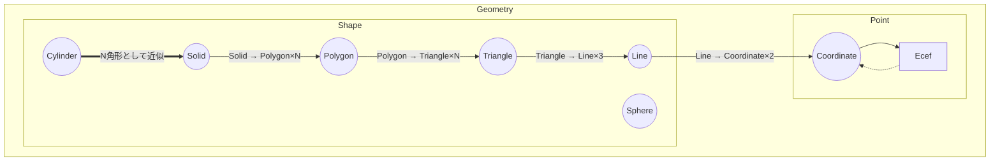

# Geometry の関係

下記の図は、`geometry` モジュール内の型とトレイトの関係を表す。

図における矢印は以下の意味を持つ。

- 太い矢印 : 近似
- 通常の矢印 : 展開または通常の変換（情報を失わない）
- 点線矢印 : 常に変換できるとは限らない

3次元空間上の空間ID以外の図形を表す型。図形から空間 ID を返す Trait は `CoverSingleIds` / `CoverRangeIds` である。

図形から空間 ID を返すメソッドは `CoverSingleIds` / `CoverRangeIds` として実装される。

`CoverRangeIds` の実装は、`CoverSingleIds` の出力を単純に `RangeId` へ変換して返すラッパー実装であってはならない。実装内部で `RangeId` を直接構築する処理を持ち、(最適でなくても) `RangeId` の表現を活かした出力を行うこと。

# Trait `Shape`

3次元空間上の図形に共通の性質を表すトレイト。現状の実装では中心点を返す `center()` を持つ。

分解可能な型は、次のトレイトを直接実装する。

- `ExpandCoordinates`
- `ExpandLines`
- `ExpandTriangles`
- `ExpandPolygons`

各トレイトは以下のメソッドを持つ。

- `expand_*()`
  - 参照を受け取り、対応する型のイテレーターを返す。

順番はなるべく意味を保つものにするが、その順序に正確な規則は保証しない。

例1:`Solid`は以下の型のイテレーターに変換できる。

- `Polygon`
- `Triangle`
- `Line`
- `Coordinate`

例2:`Triangle`は以下の型のイテレーターに変換できる。

- `Line`
- `Coordinate`

例3:`Line`は以下の型のイテレーターに変換できる。

- `Coordinate`

> [!NOTE]
> Geometryの関係は上記の図で表される。なお、内部的に保持している値ではなく、幾何学的な整合を優先して図が書かれているため、例外が存在する。例えば、実際には`Triangle`型は中に3つの`Coordinate`型を保持している。

# Trait `Point`

3次元空間上の点を表すマーカートレイト。`Into<Ecef>` を要求する。

## Type `Coordinate`

空間IDが定義される範囲内の「緯度/経度/高度」を表す。`Ecef` へは必ず変換できる。本ライブラリの性質上、大体の Geometry は `Coordinate` の集合で表現される。

## Type `Ecef`

制約のない地心直交座標系を表す。`Coordinate` への変換は常に保証されない。
