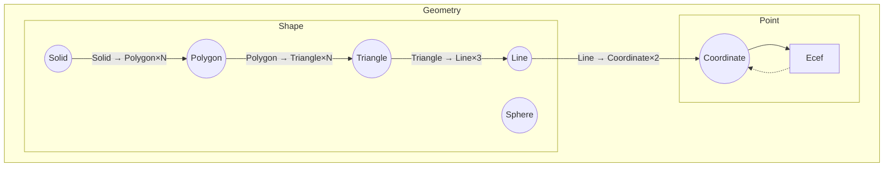

# Trait `Geometry`

3次元空間上の空間ID以外の図形を表す型。以下の関数が共通して使用することができます。

- `single_ids`
  - 指定したズームレベルの空間IDに変換することができる。
- `range_ids`
  - 指定したズームレベルの空間IDの区間表現に変換することができる。
- `optimze_single_ids`
  - 最小個数を保証して、`SingleId`を出力する。
- `optimze_range_ids`
  - 最小個数を保証して、`RangeId`を出力する。

# Trait `Shape`

3次元空間上の点以外を表す型。また、変換可能な全てのオブジェクトに対して、`Into<Box<dyn Iterator<Item = T>>> for K`を提供する。順番はなるべく意味を保つものにするが、その順序に正確な規則を保証しない。

例1:`Solid`は以下の型のイテレーターに変換できる。

- `Polygon`
- `Triangle`
- `Line`
- `Coordinate`

例2:`Triangle`は以下の型のイテレーターに変換できる。

- `Line`
- `Coordinate`

例3:`Line`は以下の型のイテレーターに変換できる。

- `Coordinate`

> [!NOTE]
> Geometryの関係は上記の図で表される。なお、内部的に保持している値ではなく、幾何学的な整合を優先して図が書かれているため、例外が存在する。例えば、実際には`Triangle`型は中に3つの`Coordinate`型を保持している。

# Trait `Point`

3次元空間上の点を表す型。

## Type `Coordinate`

空間IDが定義される範囲内の「緯度/経度/高度」を表し、`Ecef`に必ず変換することができる。本ライブラリの性質上、大体のGeometryは`Coordinate`の集合で表現される。

## Type `Ecef`

制約のない地心直交座標系を表す。必ずしも`Coordinate`に**変換することができない**。
