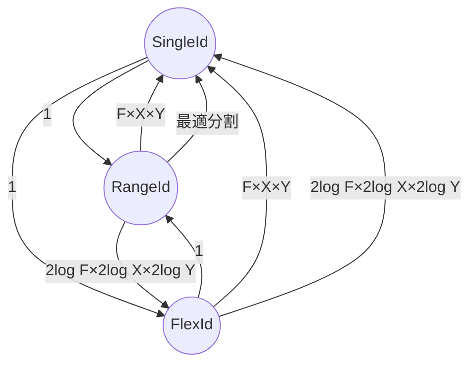

# SpatialId

`F`×`X`×`Y`の空間IDを表した場合の相互変換

## `From<T>`

1:1の変換を行う。下記の変換を実装している。

- `impl From<SingleId> for RangeId`
- `impl From<SingleId> for FlexId`
- `impl From<FlexId> for RangeId`

## `Iterator<Item = T>`

1:多の変換を行う。下記の変換を実装している。

- `impl Iterator<Item = SingleId> for RangeId`
  - `SingleId`の個数が最小となるように変換
- `imple Iterator<Item = SingleId> for FlexId`
  - `SingleId`の個数が最小となるように変換
- `impl Iterator<Item = FlexId> for RangeId`
  - `2log F×2log X×2log Y`になるように変換

`From<T>`を用いてそのまま実装するもの(出力は1つ)

- `impl Iterator<Item = RangeId> for SingleId`
- `impl Iterator<Item = FlexId> for SingleId`
- `impl Iterator<Item = RangeId> for FlexId`

意味がそのままのもの(出力は1つ)

- `impl Iterator<Item = RangeId> for RangeId`
- `impl Iterator<Item = SingleId> for SingleId`
- `impl Iterator<Item = FlexId> for FlexId`
