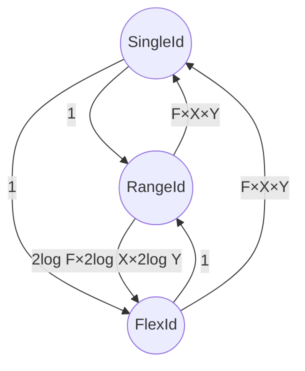

# SpatialId

`F`×`X`×`Y`の空間IDを表した場合の相互変換

## `From<T>`

1:1の変換を行う。下記の変換を実装している。

- `impl From<SingleId> for RangeId`
- `impl From<SingleId> for FlexId`
- `impl From<FlexId> for RangeId`

## `IntoSingleIds` / `IterSingleIds` / `IntoFlexIds` / `IterFlexIds` トレイト

1:多の変換を行う。下記の変換を実装している。

- `impl IntoSingleIds / IterSingleIds for RangeId`
  - 共通ズームレベルで`F×X×Y`の全展開を行う
- `impl IntoSingleIds / IterSingleIds for FlexId`
  - 各軸の最大ズームに合わせて`F×X×Y`の全展開を行う
- `impl IntoFlexIds / IterFlexIds for RangeId`
  - `2log F×2log X×2log Y`になるように変換

単一の要素を返すもの(出力は1つ)

- `impl IntoSingleIds / IterSingleIds for SingleId`
- `impl IntoFlexIds / IterFlexIds for SingleId`
- `impl IntoFlexIds / IterFlexIds for FlexId`
